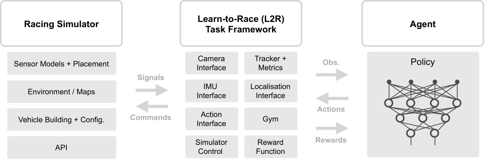
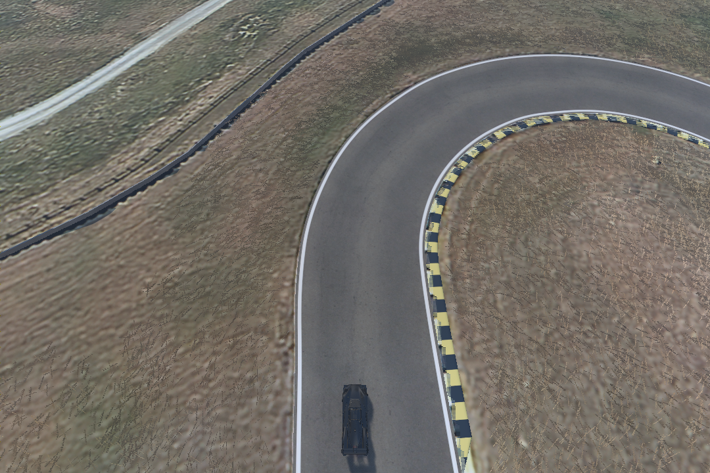

# Learn-to-Race

Learn-to-Race is an [OpenAI gym](https://gym.openai.com/) compliant, multimodal control environment where agents learn how to race. Unlike many simplistic learning environments, ours is built around Arrival’s high-fidelity racing simulator featuring full software-in-the-loop (SIL), and even hardware-in-the-loop (HIL), simulation capabilities. This simulator has played a key role in bringing autonomous racing technology to real life in the [Roborace series](https://roborace.com/), the world’s first extreme competition of teams developing self-driving AI.

<div align="center">
  <br>
  
  <p style="padding: 20px 20px 20px 20px;"><i>An overview of the Learn-to-Race framework</i></p>
  <br>
</div>

## Documentation

Please visit our [official docs](https://learn-to-race.readthedocs.io) for a comprehensive guide on getting started with the environment. Happy racing!

## Learn-to-Race Task

While learning-based agents continue to demonstrate superhuman performance in many areas, we believe that they still lack in terms of generalization abilities and often require too many interactions. In summary, agents will have the ability to learn on training racetracks, but will be evaluated on their performance on an unseen evaluation track. However, the evaluation track is not *truly* unseen. Much like a Formula-1 driver, we will let agents interact with the new track for 60 minutes during a pre-evaluation stage before true evaluation.

## Baseline Agents

We provide multiple baseline agents to demonstrate how to use Learn-to-Race including both classical and learning-based controllers. The first is a ``RandomActionAgent`` to show basic functionality. We also include a [Soft Actor-Critic](https://arxiv.org/abs/1801.01290v1) agent, *tabula rasa*, trained for 1000 epsiodes. On the Las Vegas track, it is able to consistently complete laps in under 2 minutes each using only visual features from the virtual camera as input.

<div align="center">
  <br>
  
  <p style="padding: 10px 15px 15px;"><i>Episode 1</i></p>
  
  
  <p style="padding: 10px 15px 15px;"><i>Episode 100</i></p>
  
  
  <p style="padding: 10px 15px 15px;"><i>Episode 1000</i></p>
  <br>
</div>


## Customizable Sensor Configurations

One of the key features of this environment is the ability to create arbitrary configurations of vehicle sensors. This provides users a rich sandbox for multimodal, learning based approaches. The following sensors are supported and can be placed, if applicable, at any location relative to the vehicle:

- RGB cameras
- Depth cameras
- Ground truth segmentation cameras
- Fisheye cameras
- Ray trace LiDARs
- Depth 2D LiDARs
- Radars

Additionally, these sensors are parameterized and can be customized further; for example, cameras have modifiable image size, field-of-view, and exposure. We provide a sample configuration below which has front, birdseye, and side facing cameras both in RGB mode and with ground truth segmentation. 

Left Facing                |  Front Facing             |  Right Facing             |  Birdseye
:-------------------------:|:-------------------------:|:-------------------------:|:-------------------------:
  |   |    |  
 |  |   |  

Please visit our documentation for more information about sensor customization.

## Requirements

**Python:** We use Learn-to-Race with Python 3.6 or 3.7.

**Graphics Hardware:** An Nvidia graphics card & associated drives is required. An Nvidia 970 GTX graphics card is minimally sufficient to simply run the simulator, but a better card is recommended.

**Docker:** Commonly, the racing simulator runs in a [Docker](https://www.docker.com/get-started) container.

**Container GPU Access:** If running the simulator in a container, the container needs access to the GPU, so [nvidia-container-runtime](https://github.com/NVIDIA/nvidia-container-runtime) is also required.

## Installation

Due to the container GPU access requirement, this installation assumes a Linux operating system. If you do not have a Linux OS, we recommend running Learn-to-Race on a public cloud instance that has a sufficient GPU.

1. Request access to the Racing simulator. We recommmend running the simulator as a Python subprocess which simply requires that you specify the path of the simulator in the ```env_kwargs.controller_kwargs.sim_path``` of your configuration file. Alternatively, you can run the simulator as a Docker container by setting ```env_kwargs.controller_kwargs.start_container``` to True. If you prefer the latter, you can load the docker image as follows:

```bash
$ docker load < arrival-sim-image.tar.gz
```

2. Download the source code from this repository and install the package requirements. We recommend using a virtual environment:

```bash
$ pip install virtualenv
$ virtualenv venv                           # create new virtual environment
$ source venv/bin/activate                  # activate the environment
(venv) $ pip install -r requirements.txt 
```

## Research

Please cite this work if you use L2R as a part of your research.

```
@misc{herman2021learntorace,
      title={Learn-to-Race: A Multimodal Control Environment for Autonomous Racing}, 
      author={James Herman and Jonathan Francis and Siddha Ganju and Bingqing Chen and Anirudh Koul and Abhinav Gupta and Alexey Skabelkin and Ivan Zhukov and Andrey Gostev and Max Kumskoy and Eric Nyberg},
      year={2021},
      eprint={2103.11575},
      archivePrefix={arXiv},
      primaryClass={cs.RO}
}
``` 
